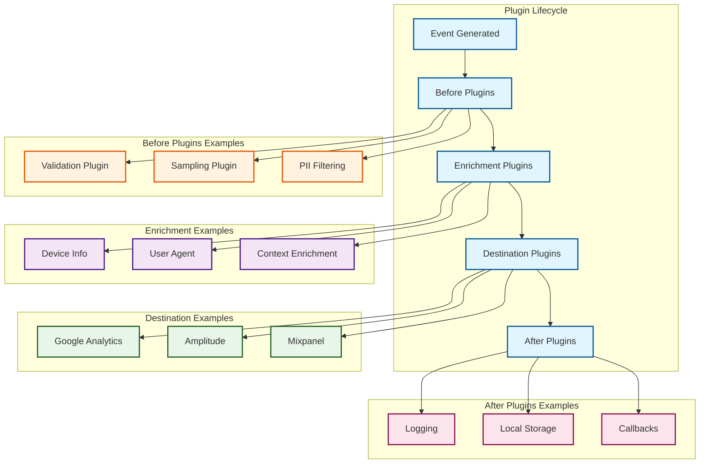

## Analytics.js Plugin Architecture

### Plugin Types Description

#### Before Plugins
- Execute before event processing
- Can modify or filter events
- Examples: validation, sampling, PII filtering

#### Enrichment Plugins
- Add additional data to events
- Enhance event context
- Examples: device info, user agent parsing, context addition

#### Destination Plugins
- Send data to external services
- Handle integration-specific formatting
- Examples: Google Analytics, Amplitude, Mixpanel

#### After Plugins
- Execute after all processing is complete
- Handle post-processing tasks
- Examples: logging, storage, callbacks
