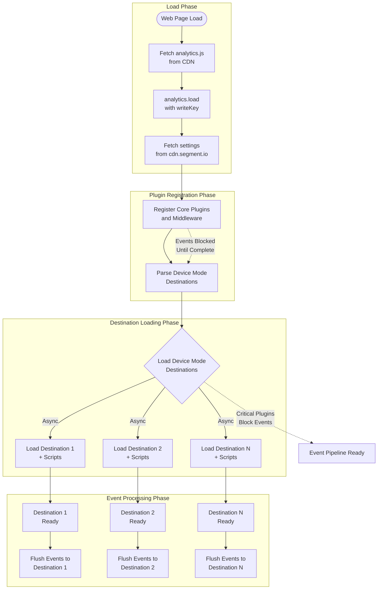
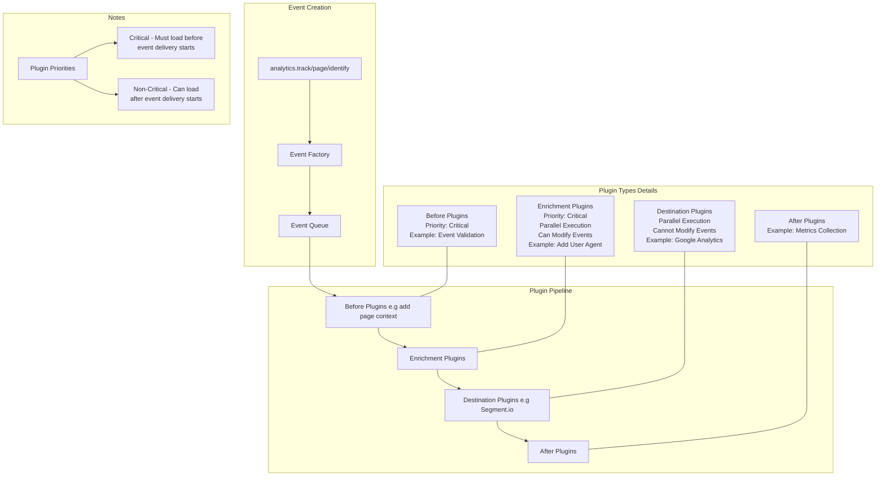

## Analytics.js Plugin Architecture

> [!IMPORTANT]
> This doc may get out-of-date. Please prefer to use and link to Segment documentation for the most up-to-date information. It would be advisable to move this doc to https://segment.com/docs/connections/sources/catalog/libraries/website/javascript, so there is a single source of truth.


### You can use the [vscode mermaid extension](https://marketplace.visualstudio.com/items?itemName=bierner.markdown-mermaid) to preview the following diagram code block inside of vscode, or copy and paste into the [mermaid live editor](https://mermaid.live/).

## Table of Contents
- [Initialization Flow](#initialization-flow)
- [Plugin Types and Middleware](#plugin-types-and-middleware)


### Analytics.js Initialization Flow
The following diagram illustrates how Analytics.js bootstraps and initializes:




Key Points:
1. **Load Phase**
   - Analytics.js is fetched from CDN
   - Initialized with writeKey that identifies your Segment source
   - CDN settings are fetched containing destination configurations

2. **Plugin Registration Phase**
   - Core plugins and middleware are registered synchronously
   - Event queue is blocked until this phase completes
   - Device mode destinations are identified from CDN settings

3. **Destination Loading Phase**
   - Device mode destinations are loaded in parallel
   - Each destination loads its own third-party scripts
   - Critical plugins (if any) must complete registration

4. **Event Processing Phase**
   - Destinations become ready independently
   - Buffered events are flushed to each destination in parallel
   - Non-critical destinations can receive events while others are still loading


### Event Flow 



### Plugin Types and Middleware
[This information is also available in the Segment documentation](https://segment.com/docs/connections/sources/catalog/libraries/website/javascript/#plugins-and-source-middleware)

- **Source Middleware** (see [Example](#example-source-middleware-implementation))
  - **Source Middleware is just a light API wrapper around a "Before" type plugin Plugin**
  - Source Middleware is the legacy API (pre-analytics next). It's less verbose than the full plugin API, but a bit less powerful. It is functionally equivalent to a "Before" type plugin.
  
- **Before Plugins** (see [Example](#example-plugin-implementation))
  - Run before any other plugins
  - Critical priority - block event pipeline until `.load()` resolves
  - Use cases: Event validation, data transformation
  - Example: Event validation before passing to other plugins)


- **Enrichment Plugins**
  - Functionally Identitical to "before" plugins, but run after them. Before plugins are typically used internally (e.g adding page info), but there's no hard and fast rule.

- **Destination Plugins**
  - Run after enrichment
  - Cannot modify the event
  - Execute in parallel
  - Failures do not halt pipeline
  - Example: Segment.io, Google Analytics, Mixpanel

- **After Plugins (uncommon)**
  - Run after all other plugins complete
  - Use cases: Metrics, logging
  - Example: segment.io plugin for observability metrics

- **Utility Plugins**
  - Executes only once during the analytics.js bootstrap. Gives you access to the analytics instance using the plugin's load() method. This doesn't allow you to modify events.
  - Do not directly process events
  - Example: some plugin that registers a bunch of analytics event listeners (e.g. analytics.on('track', ...) and reports them to an external system)
  
- **Destination Middleware** (See [Example](#example-destination-middleware-implementation))
  - A special type of plugin that allows you to add a plugin that only affects a specific (device mode) destination plugin.


### Example: Plugin Implementation
```ts
analytics.register({
  name: 'My Plugin',
  type: 'before',
  isLoaded: () => true,
  load: () => Promise.resolve(),
  // lowercase all track event names
  track: (ctx) => {
    ctx.event.event = ctx.event.event.toLowerCase()
    return ctx
  },
  // drop page events with a specific title
  page: (ctx) => {
    if (ctx.properties.title === 'some title') {
      return null 
    }
    return ctx
  }
})
``` 
### Example: Source Middleware Implementation
```ts
analytics.addSourceMiddleware(({ payload, next }) => {
  const { event } = payload.obj.context
  if (event.type === 'track') {
    // change the event name to lowercase
    event.event = event.event.toLowerCase()
  } else if (event.type === 'page') {
    // drop any page events with a specific title
    if (event.properties.title === 'some title') {
      return null
    }
}
  next(payload) 
})
```

### Example: Destination Middleware Implementation
> [!NOTE]
> It is not currently possible to add a destination middleware to the Segment.io destination.
```ts
analytics.addDestinationMiddleware('amplitude', ({ next, payload }) => {
  payload.obj.properties!.hello = 'from the other side'
  next(payload)
})
```
or, to apply to all destinations
```ts
analytics.addDestinationMiddleware('*', ({ next, payload }) => {
 ...
})
```


### Event Flow Example

When `analytics.track()` is called:

1. Event is created via Event Factory
2. Event enters the queue
3. Before plugins run, in order of registration
3. Enrichment plugins run, in order of registration
4. Destination plugins receive the event in parallel (including Segment.io plugin)
5. Any after plugins handle post-processing (e.g. metrics collection)

### Plugin Priorities

- **Critical Plugins**: Must be loaded before event delivery starts
  - Example: Before plugins, Validation plugins
- **Non-Critical Plugins**: Can load after event delivery begins
  - Example: Destination plugins


