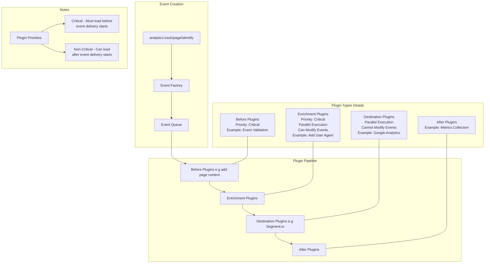

## Analytics.js Plugin Architecture

### Event Flow Diagram
More details on plugin architecture can be found here:
https://segment.com/docs/connections/sources/catalog/libraries/website/javascript/#plugins-and-source-middleware

### You can use the [vscode mermaid extension](https://marketplace.visualstudio.com/items?itemName=bierner.markdown-mermaid), or copy and paste into mermaid live editor to visualize the diagram: https://mermaid.live.

### Plugin Types Explanation
https://segment.com/docs/connections/sources/catalog/libraries/website/javascript/#add-destinations-from-npm

**Source Middleware is just a light API wrapper around a "Before" type plugin Plugin**

Source Middleware is the legacy API (pre-analytics next). It's less verbose than the full plugin API, but a bit less powerful. It is functionally equivalent to a "Before" type plugin.

1. **Before Plugins**
   - Run before any other plugins
   - Critical priority - block event pipeline until loaded
   - Use cases: Event validation, data transformation
   - Example: Event validation before passing to other plugins)

2. **Enrichment Plugins**
   - Functionally Identitical to "before" plugins, but run after them. Before plugins are typically used internally (e.g adding page info), but there's no hard and fast rule.

3. **Destination Plugins**
   - Run after enrichment
   - Cannot modify the event
   - Execute in parallel
   - Failures do not halt pipeline
   - Example: Segment.io, Google Analytics, Mixpanel

4. **After Plugins (uncommon)**
   - Run after all other plugins complete
   - Use cases: Metrics, logging
   - Example: segment.io plugin for observability metrics

5. **Utility Plugins**
  - Executes only once during the analytics.js bootstrap. Gives you access to the analytics instance using the plugin’s load() method. This doesn’t allow you to modify events.
   - Do not directly process events
   - Example: some plugin that registers a bunch of analytics event listeners (e.g. analytics.on('track', ...) and reports them to an external system)
### Event Flow Example

When `analytics.track()` is called:

1. Event is created via Event Factory
2. Event enters the queue
3. Before plugins validate/transform
4. Enrichment plugins add data in parallel
5. Destination plugins receive the event in parallel (including Segment.io plugin)
6. Any after plugins handle post-processing (e.g. metrics collection)

### Plugin Priorities

- **Critical Plugins**: Must be loaded before event delivery starts
  - Example: Before plugins, Validation plugins
- **Non-Critical Plugins**: Can load after event delivery begins
  - Example: Destination plugins

   