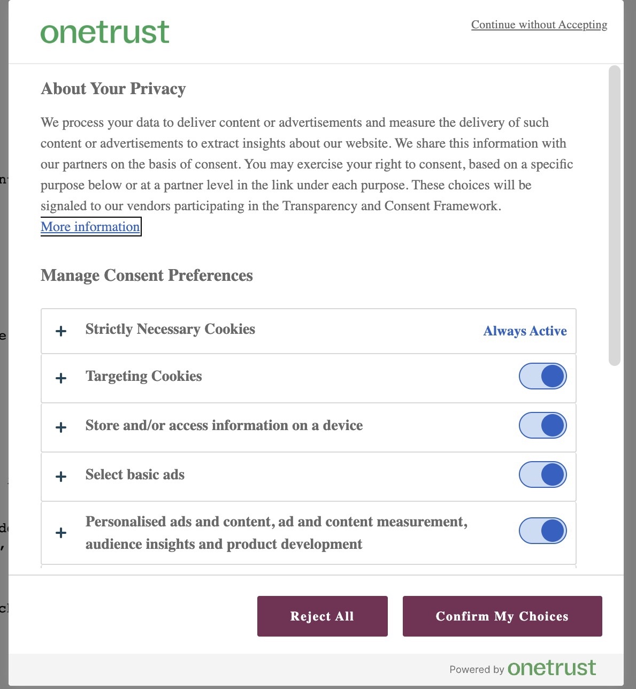
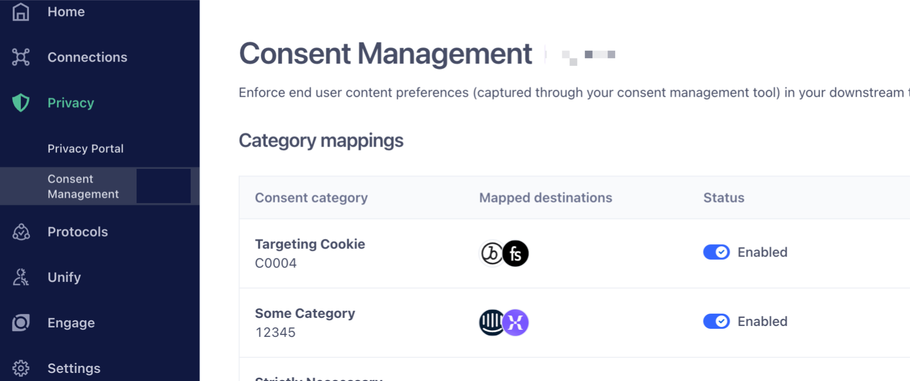

# @segment/analytics-consent-wrapper-onetrust

### Try our Playground! [Next.js CodeSandbox](https://codesandbox.io/p/sandbox/focused-bhaskara-jysqr5) 🚀



# Quick Start

## Configure OneTrust + Segment


### Requirements
Ensure that consent is enabled and that you have registered your integration-to-category mappings in Segment, which you can do through the Segment UI.

Note: "categories" are called "groups" in OneTrust.

If you don't see a "Consent Management" option like the one below, please contact support or your Solutions Engineer to have it enabled on your workspace.



- Debugging hints: this library expects the [OneTrust Banner SDK](https://community.cookiepro.com/s/article/UUID-d8291f61-aa31-813a-ef16-3f6dec73d643?language=en_US) to be available in order interact with OneTrust. This library derives the group IDs that are active for the current user from the `window.OneTrustActiveGroups` object provided by the OneTrust SDK. [Read this for more information [community.cookiepro.com]](https://community.cookiepro.com/s/article/UUID-66bcaaf1-c7ca-5f32-6760-c75a1337c226?language=en_US).


## For snippet users
### Add OneTrust snippet and integration to your page
```html
<head>
  <!-- OneTrust Cookies Consent Notice start for example.com -->
  <script
    src="https://cdn.cookielaw.org/scripttemplates/otSDKStub.js"
    type="text/javascript"
    charset="UTF-8"
    data-domain-script="0000-0000-000-0000"
  ></script>
  <script type="text/javascript">
    function OptanonWrapper() { }
  </script>

  <!-- Add Segment's OneTrust Consent Wrapper -->
  <script src="https://cdn.jsdelivr.net/npm/@segment/analytics-consent-wrapper-onetrust@latest/dist/umd/analytics-onetrust.umd.js"></script>

  <!--
    Add / Modify Segment Analytics Snippet
    * Find and replace: analytics.load('<MY_WRITE_KEY'>) -> withOneTrust(analytics).load('<MY_WRITE_KEY'>)
  -->
  <script>
    !function(){var analytics=window.analytics...
    ....
    withOneTrust(analytics).load('<MY_WRITE_KEY'>) // replace analytics.load()
    analytics.page()
  </script>
</head>
```

#### ⚠️ Reminder: _you must modify_ `analytics.load('....')` from the original Segment snippet. See markup comment in example above.
## For `npm` library users

1. Ensure that OneTrust Snippet is loaded. [See example above.](#add-onetrust-snippet-and-integration-to-your-page)

2. Install the package from npm

```sh
# npm
npm install @segment/analytics-consent-wrapper-onetrust

# yarn
yarn add @segment/analytics-consent-wrapper-onetrust

# pnpm
pnpm add @segment/analytics-consent-wrapper-onetrust
```

3. Initialize alongside analytics

```ts
import { withOneTrust } from '@segment/analytics-consent-wrapper-onetrust'
import { AnalyticsBrowser } from '@segment/analytics-next'

export const analytics = new AnalyticsBrowser()

withOneTrust(analytics).load({ writeKey: '<MY_WRITE_KEY'> })

```

## Other examples:

> Note: Playgrounds are meant for experimentation / testing, and as such, may be a bit overly complicated.
> We recommend you try to follcaow the documentation for best practice.

- [Standalone playground](/examples/standalone-playground/pages/index-consent.html)

## Environments

### Build Artifacts

- We build three versions of the library:

1. `cjs` (CommonJS modules) - for npm library users
2. `esm` (es6 modules) - for npm library users
3. `umd` (bundle) - for snippet users (typically)

### Browser Support

- `cjs/esm` - Support modern JS syntax (ES2020). These are our npm library users, so we expect them to transpile this module themselves using something like babel/webpack if they need extra legacy browser support.

- `umd` - Support back to IE11, but **do not** polyfill . See our docs on [supported browsers](https://segment.com/docs/connections/sources/catalog/libraries/website/javascript/supported-browsers).

In order to get full ie11 support, you are expected to bring your own polyfills. e.g. adding the following to your script tag:

```html
<script src="https://cdnjs.cloudflare.com/ajax/libs/babel-polyfill/7.7.0/polyfill.min.js"></script>
```

or

```html
<script src="https://polyfill.io/v3/polyfill.min.js?features=es5,es2015,es2016,es2017,es2018,es2019,es2020&flags=gated"></script>
```
