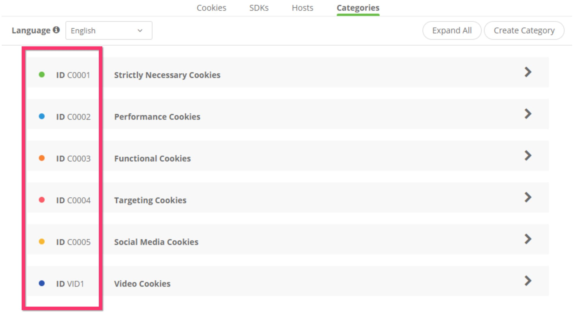

# @segment/analytics-consent-wrapper-onetrust

### Try our Playground! [Next.js CodeSandbox](https://codesandbox.io/p/sandbox/focused-bhaskara-jysqr5) 🚀


# Quick Start

## Configure OneTrust + Segment

### Ensure that the OneTrust Banner SDK is loaded first

```html
<head>
  <!-- This should be included before the Segment snippet -->
  <script
    src="https://cdn.cookielaw.org/scripttemplates/otSDKStub.js"
    type="text/javascript"
    charset="UTF-8"
    data-domain-script="0000-0000-000-test"
  ></script>
</head>
```

### Ensure that consent is enabled and that you have created your Integration -> Consent Category Mappings

- Ensure that your integrations in the Segment UI have consent enabled, and that they map to your Consent Category IDs (also called Cookie Group IDs or Cookie Consent IDs).
  The IDs look like "C0001", "C0002"and are configurable in OneTrust
  

- Debugging: this library expects the [OneTrust Banner SDK](https://community.cookiepro.com/s/article/UUID-d8291f61-aa31-813a-ef16-3f6dec73d643?language=en_US) to be available in order interact with OneTrust. This library derives the group IDs that are active for the current user from the `window.OneTrustActiveGroups` object provided by the OneTrust SDK. [Read this for more information [community.cookiepro.com]](https://community.cookiepro.com/s/article/UUID-66bcaaf1-c7ca-5f32-6760-c75a1337c226?language=en_US).

## For `npm` library users

1. Install the package

```sh
# npm
npm install @segment/analytics-consent-wrapper-onetrust

# yarn
yarn add @segment/analytics-consent-wrapper-onetrust

# pnpm
pnpm add @segment/analytics-consent-wrapper-onetrust
```

2. Initialize alongside analytics

```ts
import { withOneTrust } from '@segment/analytics-consent-wrapper-onetrust'
import { AnalyticsBrowser } from '@segment/analytics-next'

export const analytics = new AnalyticsBrowser()

withOneTrust(analytics).load({ writeKey: '<MY_WRITE_KEY'> })

```

## For snippet users (window.analytics)

1. In your head

```html
<head>
  <!-- Add OneTrust -->
  <script
    src="https://cdn.cookielaw.org/scripttemplates/otSDKStub.js"
    type="text/javascript"
    charset="UTF-8"
    data-domain-script="YOUR-DOMAIN-SCRIPT-ID"
  ></script>

  <!-- Add OneTrust Consent Wrapper -->
  <script src="https://cdn.jsdelivr.net/npm/@segment/analytics-consent-wrapper-onetrust@latest/dist/umd/analytics-onetrust.umd.js"></script>

  <!--
    Add / Modify Segment Analytics Snippet
    * Find and replace: analytics.load('<MY_WRITE_KEY'>) -> withOneTrust(analytics).load('<MY_WRITE_KEY'>)
  -->
  <script>
    !function(){var analytics=window.analytics...
    ....
    withOneTrust(analytics).load('<MY_WRITE_KEY'>) // replace analytics.load()
  </script>
</head>
```

#### ⚠️ Reminder: _you must modify_ `analytics.load('....')` from the original Segment snippet. See markup comment in example above.

## Other examples:

> Note: Playgrounds are meant for experimentation / testing, and as such, may be a bit overly complicated.
> We recommend you try to follcaow the documentation for best practice.

- [Standalone playground](/examples/standalone-playground/pages/index-consent.html)

## Environments

### Build Artifacts

- We build three versions of the library:

1. `cjs` (CommonJS modules) - for npm library users
2. `esm` (es6 modules) - for npm library users
3. `umd` (bundle) - for snippet users (typically)

### Browser Support

- `cjs/esm` - Support modern JS syntax (ES2020). These are our npm library users, so we expect them to transpile this module themselves using something like babel/webpack if they need extra legacy browser support.

- `umd` - Support back to IE11, but **do not** polyfill . See our docs on [supported browsers](https://segment.com/docs/connections/sources/catalog/libraries/website/javascript/supported-browsers).

In order to get full ie11 support, you are expected to bring your own polyfills. e.g. adding the following to your script tag:

```html
<script src="https://cdnjs.cloudflare.com/ajax/libs/babel-polyfill/7.7.0/polyfill.min.js"></script>
```

or

```html
<script src="https://polyfill.io/v3/polyfill.min.js?features=es5,es2015,es2016,es2017,es2018,es2019,es2020&flags=gated"></script>
```
